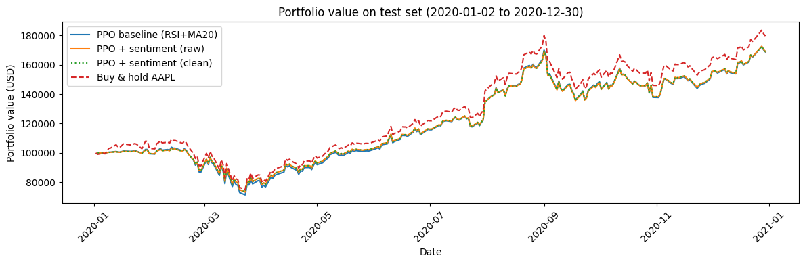
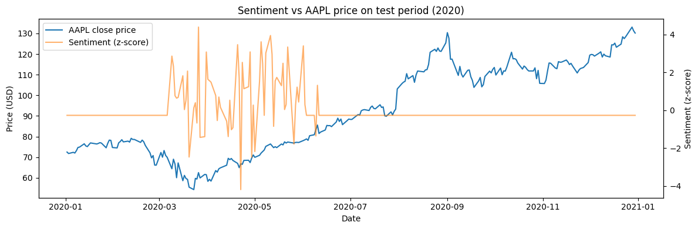

# Learning to Trade: PPO with Technical Indicators and FinBERT News Sentiment

A reinforcement-learning trading agent for a single stock (AAPL). A **PPO** agent (Stable-Baselines3 on a FinRL trading environment) learns daily position sizing from technical indicators, with or without a **FinBERT** news-sentiment signal. It trains on 2018–2019 and is tested out-of-sample on 2020.

**Questions:** Can an RL agent learn a trading strategy that holds up against buy-and-hold? Does adding news sentiment help?

Two-person project (Kyle Mollard, Donald Chan) · CMPT 419 Special Topics in AI: Fintech and AI in Finance, Simon Fraser University · Fall 2025
I carried the build: data prep, FinBERT sentiment scoring, the custom log-return reward, PPO training, and evaluation. My teammate contributed ideas and feedback on direction.

**Stack:** Python · Stable-Baselines3 (PPO) · FinRL · Gymnasium · PyTorch · Hugging Face Transformers (FinBERT) · pandas · yfinance



---

## Results (out-of-sample, 2020)

| Strategy | Final value (from $100k) | Total return | Sharpe (annualized, log returns) |
|---|---|---|---|
| PPO baseline (RSI + MA20) | $168,709 | 68.7% | 1.15 |
| PPO + sentiment (raw) | $169,002 | 69.0% | 1.21 |
| PPO + sentiment (cleaned) | $168,905 | 68.9% | 1.21 |
| **Buy & hold AAPL** | **$179,624** | **79.6%** | **1.26** |

- **PPO tracked buy-and-hold but didn't beat it** on either return or risk-adjusted return (Sharpe).
- **Sentiment made almost no difference:** +0.3% return and about +0.06 Sharpe, well within what a different random seed could produce. A second run didn't reproduce even that small edge.

## Why sentiment didn't help: a data-coverage problem

Looking back at the pipeline, the non-result has a concrete cause. The FNSPID news dataset has **AAPL headlines only from 2020-03-09 to 2020-06-10** (473 headlines).

- The **training period (2018–2019) had no news at all**, so for the sentiment agents the sentiment feature was a constant 0 throughout training. The raw- and cleaned-sentiment agents produced identical training logs, which fits: neither ever saw a non-zero sentiment value.
- In testing, sentiment only switches on for about three months (see below). Any difference between the PPO variants therefore comes from an input the agents never learned to use, not from a learned signal.



The fix is news coverage that spans the training window. Running multiple seeds and reporting mean ± standard deviation would then show whether any sentiment effect is real.

## Approach

| Component | Details |
|---|---|
| Data | AAPL daily OHLCV from yfinance, 2018–2020 |
| Features | RSI(14) and 20-day moving average, computed only from data up to day *t* |
| Sentiment | FNSPID headlines scored by [FinBERT](https://huggingface.co/ProsusAI/finbert) as P(positive) − P(negative), averaged per day. The "cleaned" variant is z-scored on the training period only, clipped at ±3, and smoothed with a 3-day rolling mean. |
| Environment | FinRL `StockTradingEnv` with a custom **log-return reward**, log(V<sub>t</sub> / V<sub>t−1</sub>), continuous actions in [−1, 1], and 0.1% buy/sell transaction costs |
| Agent | PPO (Stable-Baselines3), 50k timesteps, fixed seed (42) |
| Evaluation | Strict time split: train Mar 2018 – Dec 2019 (463 days), test 2020 (252 days), no overlap. Metrics are final value, total return, and annualized Sharpe from daily log returns. |

## Repository layout

```
├── notebooks/
│   └── learning_to_trade_ppo_finbert.ipynb   # full pipeline with saved outputs (Google Colab)
├── docs/
│   ├── presentation.pdf                      # final project presentation
│   └── *.png                                 # figures used above
└── reference/
    └── finrl-contest-starter-kit/            # FinAI Contest starter code we studied early on (not our method)
```

## Running it

The notebook was built for **Google Colab** (Python 3.12). Run the cells top to bottom. The first cell installs `finrl==0.3.8`, `stable-baselines3`, `gymnasium`, `yfinance`, and `transformers`. Price data downloads from yfinance and the FNSPID news file from Hugging Face. Neither is stored in this repo.

## Next steps

- Use a news source that covers the full training window, compare scoring headlines with full article text, and try other models (FinGPT, GPT-4o-mini) as the sentiment scorer.
- Run multiple seeds and time windows, and report mean ± standard deviation instead of single runs.
- Try other algorithms (SAC, DQN) and a multi-asset portfolio environment.
